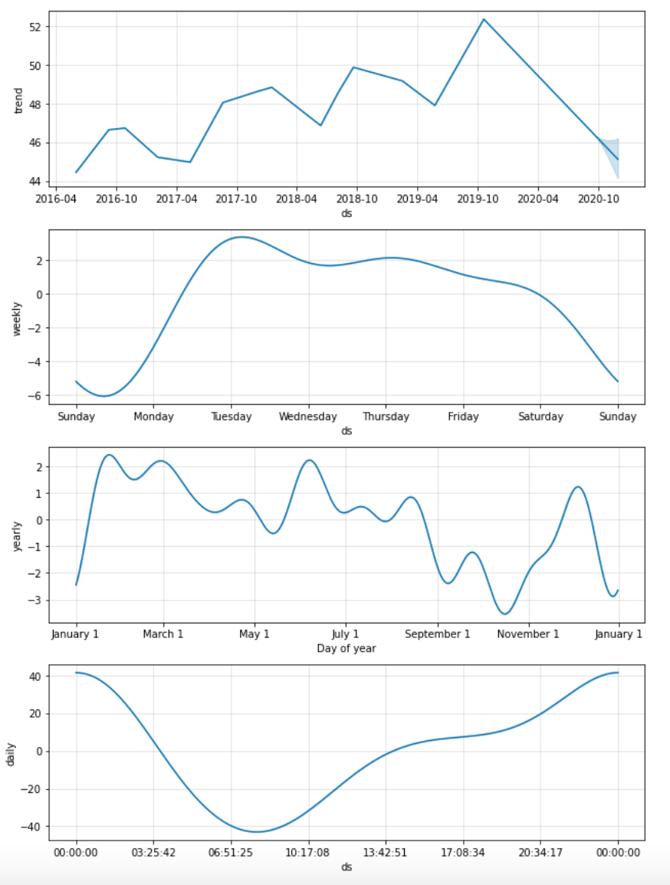

# Analysis and Forecasting for MercadoLibre

This Jupyter notebook provides an analysis and forecasting of MercadoLibre Google Search Trends and Stock Price.

Specifically, it carries out the following steps:
1. Looks for unusual patterns in hourly Google search traffic
2. Mines the search traffic data for seasonality
3. Relates the search traffic to stock price patterns
4. Creates a time series model with Facebook Prophet

---

## Technologies

This Jupyter notebook makes use of the following Python libraries:
* Pandas
* PyViz - Holoviews and hvPlot library
* Facebook Prophet
* Datetime
* Numpy
* Matplotlib

---

## Installation Guide

To use this notebook:
* This notebook can be run in Google Colab without any additional prerequisites.
* Google Colab has a base configuration of Python 3 that contains many of the required components.
* The remaining dependencies are automatically installed at runtime if you rerun each cell of the notebook.

---

## Examples

Here are examples of the interactive plots and Facebook Prophet forecasts in this notebook:

---

## Contributors

Michael Danenberg

---

## License

MIT